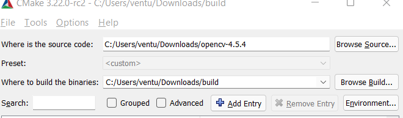
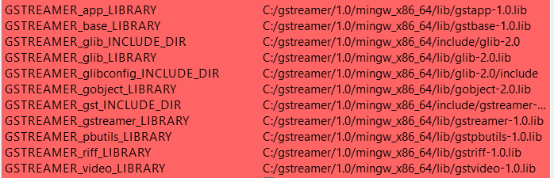

## Contributors

Philip Lapinski, Viet Le, Steven Zhou, Jake Taylor, Themba Binns, Nathanael Hansell

## WatchIT Overview
WatchIT is a system that allows users to connect a video feed with object recognition to run user defined actions. By using an online control interface and embedded devices, Users can set up a device, select which objects to detect and then assign actions to be taken, after the object is recognized. Users are also able to have multiple configurations of objects and actions, allowing them to watch over multiple scenarios. Want to know who has been stealing your stuff from the pantry? Setup a device, pick what was stolen as the object and pick an action to be run when the camera sees it.

### Front End
The current production link is 34.201.36.147

### PC Setup for CUDA OpenCV

**1. Downloads** 
* [Miniconda](https://docs.conda.io/en/latest/miniconda.html) Python from python.org did not work for me, missing a DLL
* latest [OpenCV](https://opencv.org/releases/) as of this update it is 4.5.4
* [OpenCV-Contrib](https://github.com/opencv/opencv_contrib/tree/4.5.4) extra modules for opencv
* [Cuda Tookit 11.4.3](https://developer.nvidia.com/cuda-11-4-3-download-archive?target_os=Windows&target_arch=x86_64&target_version=11&target_type=exe_local) 
* [CuDNN](https://developer.nvidia.com/rdp/cudnn-archive) Requires signing up for Nvidia Developer Account
* [CMake](https://cmake.org/download/) Used 3.22.0-rc3
* [Gstreamer](https://gstreamer.freedesktop.org/data/pkg/windows/1.18.5/mingw/gstreamer-1.0-devel-mingw-x86_64-1.18.5.msi) Install developer tools
* [Visual Studio](https://visualstudio.microsoft.com/downloads/)

**2. CUDA and CuDNN**
* Run installer for CUDA, only core files are used for this project
* Unzip CuDNN and look for bin, include, lib
* Find CUDA installation on your main drive
* Go inside CuDNN bin and copy over to CUDA bin
* Repeat for include and lib

**3. CMAKE**
* Unzip OpenCV and OpenCV_Contrib
* Create build folder, this will be the location where Visual Studio will build OpenCV

* Source is location of your openCV folder and build is location of your build folder
* Install numpy to the environment where you will be installing OpenCV
* Click configure specify your version of Visual Studio as generator and Finish
* Ensure that Gstreamer is has path location to the devel files similar to what is shown

* Check the following WITH_CUDA, OPENCV_DNN_CUDA, ENABLE_FAST_MATH
* Link OPENCV_EXTRA_MODULES_PATH to your opencv-contrib-4.5.4\modules that we downloaded
* Click configure again after selecting the previous
* Check CUDA_FAST_MATH and enter your CUDA_ARCH_BIN (can find the compute capability version related to your video card [here](https://en.wikipedia.org/wiki/CUDA)
* Click generate

**4.Visual Studio**
* Find **OpenCV.sln** located in the build folder and open it with Visual Studio
* Change debug mode to release mode 

* Expand the CMakeTarget folder along the right side
* Right click **ALL_BUILD** and build
* After completion right click **INSTALL** and build

**5.Verify**
* import CV2
* cv2.__version__
* cv2.cuda.getCudaEnabledDeviceCount()
